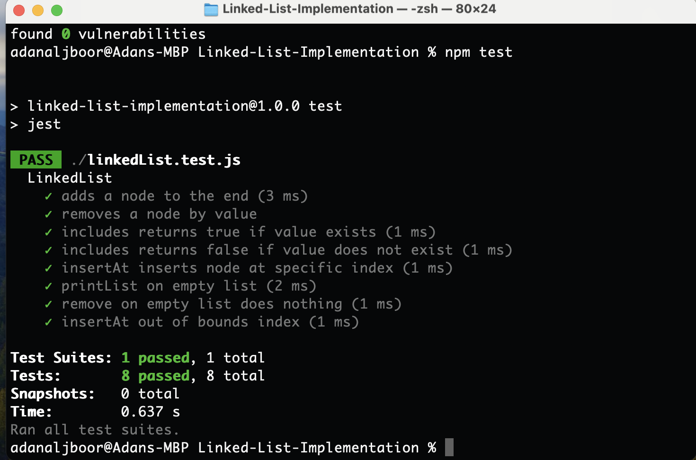
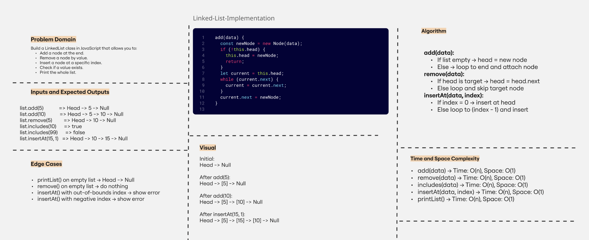

# Linked List (Singly)

This is a simple JavaScript project that builds a basic **Singly Linked List**.

---

## ✅ What I learned

- How a linked list works step by step.
- How to add, remove, and search for items in the list.
- How to handle edge cases like an empty list or invalid index.
- How to write tests using Jest.

---

## 📁 Project Files

- `linkedList.js`: Main code for the linked list.
- `linkedList.test.js`: Tests using Jest.
- `console-output.png`: Screenshot showing test results.
- `README.md`: Project notes.

---

## 🧪 Functions tested

- `add(data)`: Add item to the end.
- `remove(data)`: Remove first item with that value.
- `includes(data)`: Check if value exists.
- `insertAt(data, index)`: Insert item at a specific index.
- `printList()`: Print the list.
- Edge cases (empty list, index out of range).

---

## 📸 Console Output

---

## 💪 Project Status

- ✅ All tests passed  
- ✅ Code is working  
- ✅ Edge cases handled

## 🧠 Whiteboard Diagram

