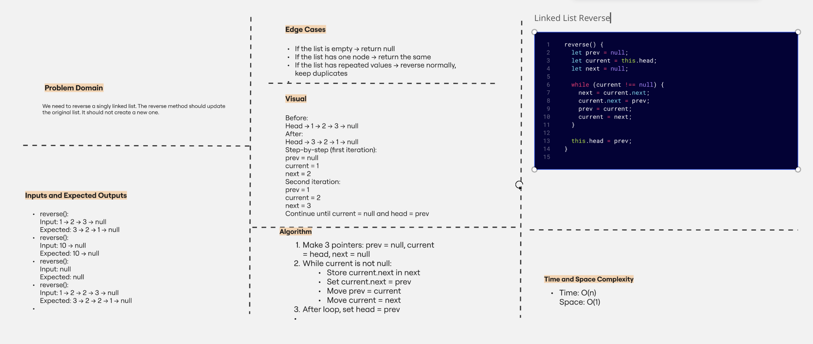

# Reverse Linked List

A coding challenge to reverse a singly linked list using JavaScript.

---

## 📘 What did you learn?

I learned how to reverse the order of a linked list by using three pointers (`prev`, `current`, and `next`) and how to update the `head` after the loop.

---

## 💡 How did you solve this problem?

I used a `while` loop to go through the list and change the direction of each node's `.next` pointer until I reached the end. Then I updated the `head` to point to the last node.

---

## ⏱️ How long did it take?

It took me around 1 hour to understand and implement the solution, and to write the whiteboard and documentation.

---

## 🖼️ Whiteboard

---

