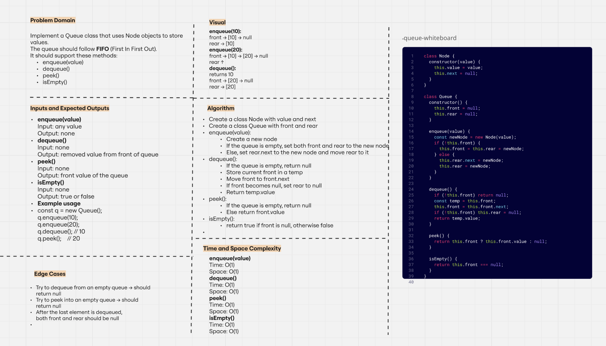

# Stack and Queue

This folder contains the implementation of **Stack** and **Queue** data structures using JavaScript classes.

Each structure has:
- A JS file with the class implementation.
- A test file using Jest.
- A whiteboard image explaining the logic.

---

## Stack

---

## Queue

