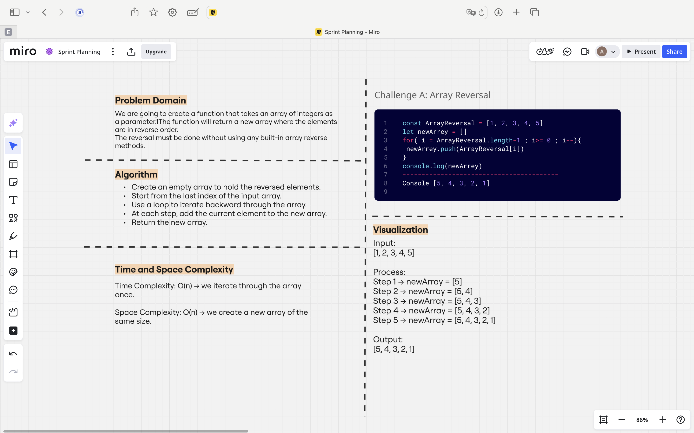
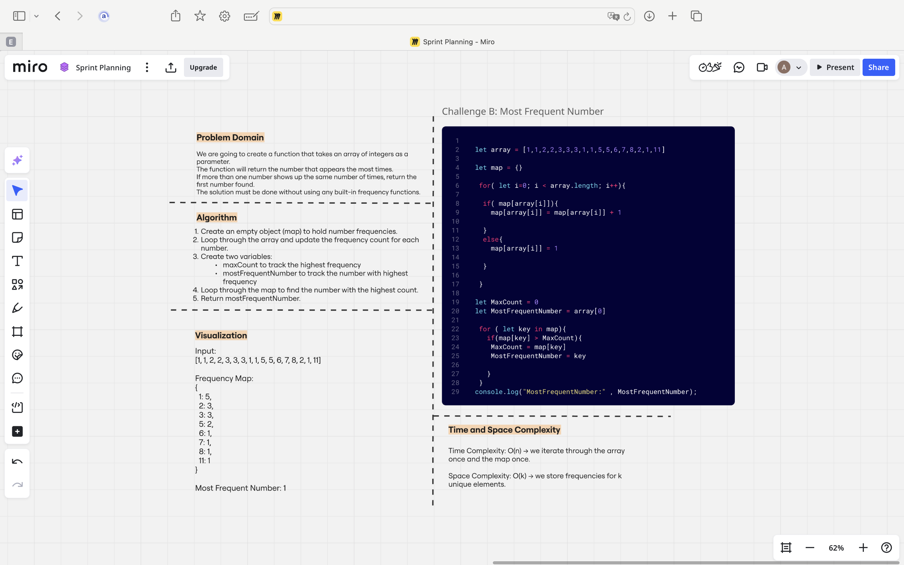
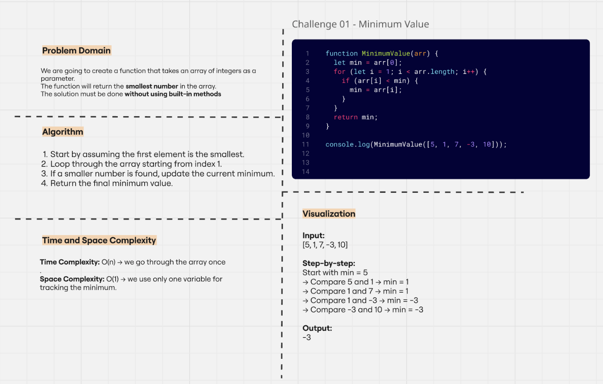

# Challenges and Data Structures

This repository contains my whiteboard solutions for the assigned challenges in Full-Stack JavaScript.

---

## Challenge A: Array Reversal

### Description
We need to create a function that takes an array of numbers and returns a new array with the numbers in reverse order.  
We are not allowed to use built-in methods like `reverse()`.

Example:  
Input → [1, 2, 3, 4, 5]  
Output → [5, 4, 3, 2, 1]

### Whiteboard

-------------------------------------

## Challenge B: Most Frequent Number

### Description
We need to create a function that takes an array of numbers and returns the number that appears the most.  
If two or more numbers have the same highest frequency, return the first number found.

Example:  
Input → [1, 1, 2, 2, 3, 3, 3, 1, 1]  
Output → 1

### Whiteboard

-------------------------------------

## Challenge 01: Minimum Value

### Description  
We need to create a function that takes an array of integers and returns the smallest number.  
We are not allowed to use any built-in functions like `Math.min()` or `sort()`.

---

### Example  
Input → [5, 1, 7, -3, 10]  
Output → -3

---

### Whiteboard  

